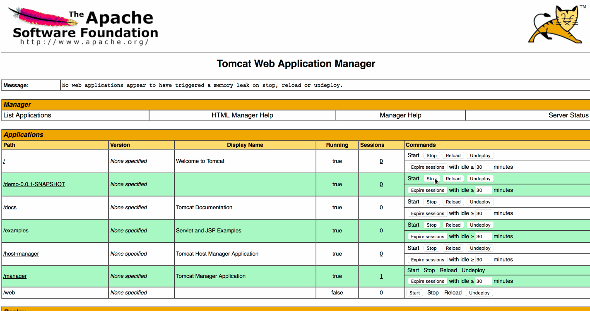

# 问题描述
Java Web程序中引入ElasticJob在应用关闭之后存在内存泄露的问题，每stop一次就会多一个内存泄露项。

# 疑问
如何在关闭应用时，正确地释放相应资源？

# 项目使用
1. 启动zookeeper
1. 修改（检查）application.yml中zookeeper配置
1. 打包war,执行 `mvn -DskipTests package`,在target目录下找到demo-0.0.1-SNAPSHOT.jar
1. 将resources/libs下jar包拷贝到tomcat合适的lib目录中
1. 启动Tomcat（可通过catalina.sh run命令查看日志）,并部署war包，应用可正常启动