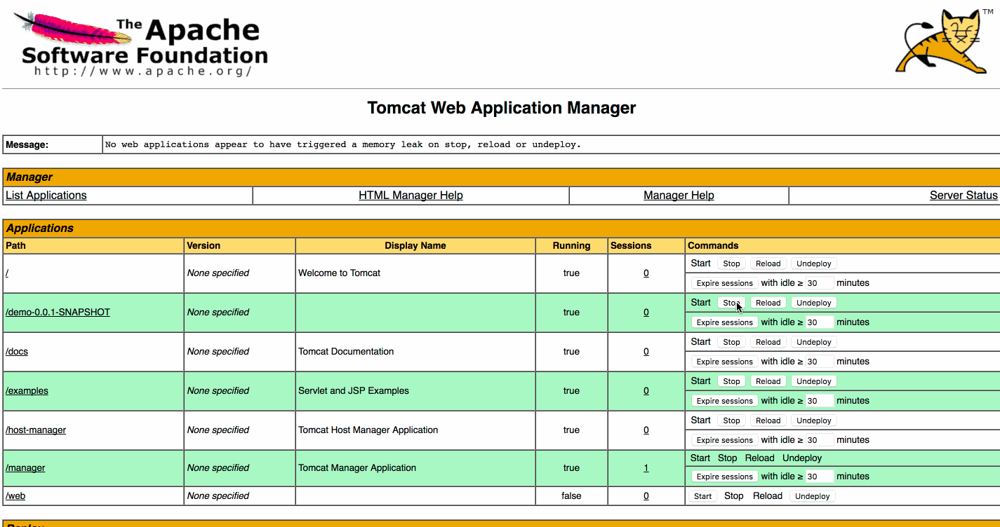

# Problem Description
ElasticJob will lead memory leaks when stopped in Tomcat.

# Question
How to stop elastic job properly without memory leak?

# Steps to Run
1. Start zookeeper
1. change configurations inside application.yml
1. make war by executing `mvn -DskipTests package`, and then you will find demo-0.0.1-SNAPSHOT.jar under directory of `target`
1. copy jars from resources/libs to lib directory under tomcat
1. start Tomcat by running cmd `bin/catalina.sh run`, then deploy the war from previous step
